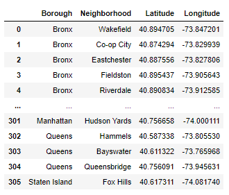
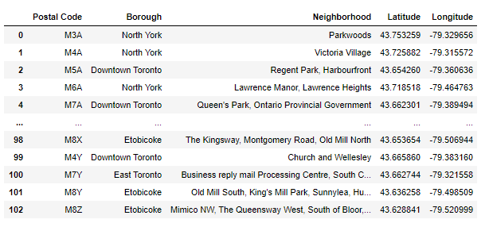
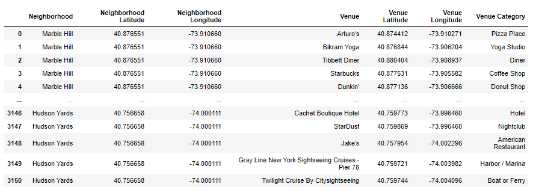
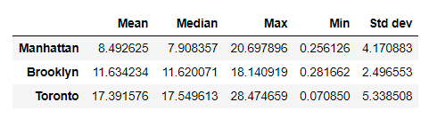

# Comparing distribution of distances between pizza shops at NewYork and Toronto

## Introduction

For shop owners, distances between the same category of stores which can be regarded as competitors is important because it could affect the profit of store. Therefore, calculating the distribution of distance between competitors allow owners to recognize the competition between same category of stores. This project is focused on estimating distribution of distances between pizza shops and comparing this distribution on NewYork and Toronto. As conclusion, this project shows that which NewYork or Toronto is better for pizza shops.

## Methodology

### Data

Our data is consist of two components. First, geolocation data of NewYork and Toronto. And second, Venue information retrived from Foursquare.

#### Geolocation data of NewYork

#### Geolocation data of Toronto

#### Example of venus data retrived from Foursquare

### Methodology

- Make Foursquare query from latitude and longitude in geolocation data. To reduce api call, geolocation data of NewYork of which borough is Manhattan and Brooklyn.
- Extract venues which has category of Pizza shop or Pizza place etc.
- Calculate top5 distances from venues latitude and longitude.
- Calculate statistical variables of the distance distribution and draw historgram of the distribution.
- Comparing statistical variables between NewYork and Toronto.

## Result

Distribution of distances of each city

Table of statistical variables(Unit: Km)

Result shows that Manhattan has the lowest mean and median distance between pizza shops followed by Brooklyn and Toronto.

## Conclusion

The lower mean distance can mean high competition state. Therefore, Manhattan can be most difficult city to pizza owners.